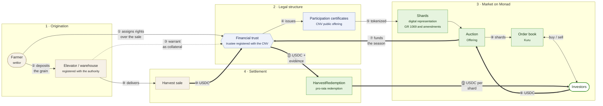

# FractaChain: legal and operations plan

> How to bring Argentine harvests onchain in a legal and workable way, how the initial market on Kuru is formed and what comes after the hackathon.
> Draft of October 9, 2026. This is not legal advice: sections marked **[to be validated]** need review by a law firm before operating with real money.

## 1. Summary

FractaChain turns a harvest (for example, 100 t of corn from the 2026/27 season) into **shards**: tokens that represent a fraction of that lot's sale proceeds. Shards are placed in a fixed-price **primary auction**, then trade on **Kuru**'s order book on Monad and, when the harvest is sold, are **redeemed** for their share of the USDC from the sale.

The central legal point is this: a homogeneous, fungible token offered to the public in exchange for a share of a business's income is, under the definition in Argentina's Capital Markets Law 26,831, a **security** (*valor negociable*: "any security or investment contract [...] homogeneous and fungible [...] capable of general and impersonal trading"). So the way to operate with the public is not to avoid the CNV (Argentina's securities regulator) but to use the regime the CNV created for this: **publicly offered financial trusts whose participation certificates are represented digitally** (General Resolution 1069/2025 and amendments, with a sandbox in force until December 31, 2027 under General Resolution 1150/2026). This path already has an approved agri precedent in Argentina (section 4.3).

## 2. Asset class and customers

### 2.1 Asset

**Proceeds from the sale of Argentine harvests** (soy, corn, wheat; extendable to other agricultural products), structured by lot and by season.

- Each lot has an identified asset: type, quantity, unit and season. Today these are recorded onchain at issuance (`IssuanceFactory.createIssuance`).
- A shard entitles its holder to `shards × settled amount / total supply` of the USDC the issuer deposits when the harvest is sold (`HarvestRedemption`).
- It is an asset with real, seasonal cash flows and a public reference price (grain futures quotes), which today **does not exist as a liquid onchain market** on Monad.

### 2.2 Customers

| Side | Who | What they need |
|---|---|---|
| Issuer | Farmer or agro-industrial SME | Finance the season before harvest, without relying only on banks or on barter deals with the grain elevator. |
| Investor | Local or foreign saver with USDC | Exposure to a real Argentine asset, with small amounts and the option to exit before maturity. |
| Operating partner | Grain elevator, cooperative or licensed warehouse (*warrantera*) | New services (grain custody, certification) and retention of farmer customers. |

### 2.3 Evidence of demand

- **Farmers need financing.** According to the Rosario Board of Trade, farmers invested about US$ 13,821 million in the 2024/25 season: 30% with their own capital and 70% with third-party financing. Most of that external financing came from the commercial circuit (elevators, input suppliers, traders), and only about a third from banks and capital markets.
- **The SME capital market is growing.** The Argentine Securities Market (MAV) recorded $5.8 trillion pesos in deferred-payment check trading in the second half of 2025, up 139% year on year. Farmers already use tradable instruments to fund themselves.
- **There is retail demand for tokenized agri assets.** Landtoken, with a CNV-approved tokenized farmland trust, reported more than 12,000 registered users and US$ 2.2 million traded in two years, with a minimum investment of US$ 50.
- **Farmers already accept digital grain.** Agrotoken has tokenized grain deposited in elevators (1 token = 1 ton) since 2022 and uses it as a means of payment and loan collateral, with banks such as Santander.

What is **missing** from that map, and what FractaChain brings: an **onchain secondary market open 24/7** for season financing, with price discovery on an order book and early exit for the investor.

## 3. Legal nature of the shard

| Option | What it is | Useful for | Limit |
|---|---|---|---|
| Sale of a future good (Civil and Commercial Code, art. 1131) | The farmer sells grain that does not exist yet; the contract is conditional on the good coming into existence, unless the buyer assumes that risk. | Bilateral or consumer contracts (the buyer wants the grain). | Offered in series to the public as an investment, the shard becomes a security. Not enough for an open offering. |
| Deposit certificate and warrant (Law 9643) | Titles issued by a registered warehouse on deposited goods: the certificate proves ownership and the warrant lets the goods be used as collateral. Decree 640/2024 allows issuing and trading them electronically, in any technological format. | Backing and collateral for grain already harvested and deposited. | Requires physical grain in storage: it does not finance before harvest. A good **underlying asset**, not the investor's token. |
| **Participation certificate of a financial trust, represented digitally** (Law 26,831, General Resolutions 1069/1081/1087/1150) | The farmer transfers to the trust the rights over the harvest sale (and the warrant, when there is one); the trustee issues publicly offered participation certificates and the CNV authorizes their representation as tokens. | Public offering to retail investors, secondary trading and ring-fencing of the asset. | Structuring cost and time; CNV supervision; the sandbox has an end date. |

**Structure chosen to operate with the public: a publicly offered financial trust with digital participation certificates.** The sale of a future good and the warrant are used **inside** that structure: the first as the contract between the farmer and the final buyer of the grain, and the second as collateral once the grain is deposited.

**[to be validated]** The exact framing of the underlying asset (collection rights over the future sale versus deposited grain with a warrant) and whether a global program with one series per lot is admissible under the CNV's financial trust rules.

## 4. Proposed legal structure

### 4.1 Parties

The lot goes through four stages. Numbers follow the order of events; thick arrows are USDC, thin arrows are titles or goods, and the dotted arrow is the collateral.

| Role | Who | Function |
|---|---|---|
| Settlor | Farmer or SME | Contributes the rights over the lot's sale and commits to produce and deliver. |
| Trustee | Entity registered as a financial trustee with the CNV | Holds the ring-fenced assets; issues the certificates; receives the sale proceeds. |
| Administrator and technical agent | FractaChain (Argentine company) | Origination, due diligence, platform, smart contracts and reporting. |
| Grain depositary | Elevator or warehouse listed in the Registry of Warehouses (*Registro de Warranteras*) | Custody, deposit certificate, warrant and insurance of the goods. |
| Placement and distribution | Brokers (ALyC) and virtual asset service providers (PSAV) registered with the CNV | Placement of the series and investor access; the PSAV operates the digital version. |
| Digital representation issuer | Tokenization provider admitted under the regime | Issues the tokens and reconciles them with the certificate registry. |
| Auditor and control agent | Accounting firm | Verifies the existence of the grain, the sale settlement and the distribution. |

### 4.2 Why a trust and not just a contract

- **Ring-fencing:** if the farmer or FractaChain goes bankrupt, the lot and its proceeds are not part of their estate.
- **Legal public offering:** allows placing with retail investors, advertising the auction and trading on a secondary market.
- **A regime already designed for tokens:** General Resolution 1069/2025 first regulated precisely the digital representation of participation certificates of financial trusts whose underlying assets are "real-world assets".

### 4.3 Precedent

In August 2025 the CNV authorized the public offering of a financial trust of productive farmland with tokenized participation certificates (Landtoken program, trustee Allaria Fiduciaria S.A., agricultural operator Adecoagro), tradable on registered PSAV platforms. It is the country's first offering of digital securities under this regime and shows that the structure can be approved for agri assets.

## 5. From smart contract to legal document

| Contract (Monad) | Legal function it reflects |
|---|---|
| `KycRegistry` | Register of identified investors (KYC/AML) allowed to subscribe in the primary placement. |
| `IssuanceFactory` | Creation of a series: asset data, supply, price, minimum, maximum and term, matching the prospectus supplement. |
| `ShardToken` | Digital representation of the series' participation certificates. Fixed supply, minted once. |
| `Offering` | Subscription period: fixed price, minimum (automatic refund if not reached), maximum and term. |
| Kuru market | Secondary trading of the digital representation. |
| `HarvestRedemption` | Pro-rata distribution of the sale proceeds, with a link and hash of the evidence (the elevator's settlement statement). |

**Known gap:** today KYC applies only to the primary auction and the shard circulates freely on Kuru. To operate under the CNV's digital regime, secondary trading must happen between investors identified by a PSAV. The planned solution is a **permissioned wrapper** (an allowlist of addresses verified by the PSAV) for the regulated version of the token. **[to be validated]** The regime's specific requirements for secondary trading of digital securities on decentralized platforms.

## 6. Operating cycle of a lot

1. **Origination.** FractaChain and the elevator identify the farmer and verify the planted area, yield history and crop insurance.
2. **Structuring.** The lot is defined (crop, committed tons, season), along with the price per shard, minimum, maximum and term. The series is issued within the trust program and the prospectus supplement is approved.
3. **Auction.** Verified investors subscribe in USDC. If the minimum is reached, the funds go to the trust to finance the season; if not, each investor gets their contribution back without anyone's intervention.
4. **Market opening.** When the auction closes, the shard/USDC pair opens on Kuru and its initial liquidity is seeded (section 8).
5. **Season monitoring.** Periodic reports to investors: crop status, estimated harvest and reference price.
6. **Harvest and deposit.** The grain enters the elevator; the deposit certificate and the warrant are issued in favor of the trust.
7. **Sale and settlement.** The grain is sold. The trustee receives the proceeds, converts them to USDC and deposits them in `HarvestRedemption` along with the evidence (the elevator's settlement statement, the sale contract).
8. **Redemption.** Each holder redeems their shards for their pro-rata share; redeemed shards stay locked.
9. **Default.** If the farmer does not deliver, the trustee enforces the collateral: warrant, insurance and contracts. The smart contract guarantees the distribution; collection depends on this legal structure.

## 7. Compliance

- **PSAV.** Law 27,739 created the figure of Virtual Asset Service Provider (PSAV) and put the CNV in charge of its registration and supervision. General Resolution 1058/2025 regulates the registry; since May 26, 2025 registration is filed through the government's online procedures platform (TAD). FractaChain, or the partner operating the platform, must register if it holds, exchanges or transfers virtual assets on behalf of third parties.
- **Anti-money laundering.** KYC of investors and issuers, transaction monitoring, a compliance officer and reports to the Financial Intelligence Unit (UIF) under the rules for PSAV and capital-market agents. **[to be validated]** The UIF resolution currently in force for PSAV.
- **Transparency.** Lot data recorded onchain, settlement evidence with a verifiable hash and public activity for every transaction.
- **Taxes.** **[to be validated]** Tax treatment of the digital certificates for resident and non-resident investors, and of the trust.

## 8. Liquidity and initial market formation

A token without a secondary market is of no use to the investor. The strategy combines what is already built with incentives for the first lots.

1. **Seeding by the issuer (implemented).** When the auction closes, the issuer opens the market on Kuru and seeds its vault with unsold shards and part of the proceeds, **at the auction price**. The opening price stays anchored to the primary. Tested on Monad testnet: market created and vault seeded from the interface.
2. **Liquidity providers (implemented).** Any holder can deposit shards and USDC into the vault at the current price and earn part of the fees. On a testnet fork, adding 2,000 shards and 241.6 USDC cut the price impact of a 10 USDC buy from ~11% to ~3%.
3. **Per-series liquidity reserve.** A percentage of each lot's supply is issued for the vault and not sold in the auction. That parameter is part of the lot's structure.
4. **Designated market maker.** An agreement with a market maker to keep limit orders on both sides with a maximum spread. Kuru offers liquidity introductions to selected teams.
5. **Value anchor.** The price has an external reference: committed tons × grain futures price. Arbitrage between the shard price and the expected settlement value keeps the book in order.
6. **Depth bounded by lot size.** The demo uses a lot with a large supply and low caps, so the issuer receives enough shards to seed a realistic vault.

## 9. Risks and mitigation

| Risk | Mitigation |
|---|---|
| Weather or yield | Crop insurance; issuance caps below expected production; diversification by region and crop. |
| Grain price | Disclosure of the market reference; hedging with futures as an option for the issuer. |
| The issuer does not sell or settle | Trust with assignment of rights, warrant over the deposited grain and the trustee's contractual obligation. |
| Elevator counterparty | Only registered warehouses, with insurance of the goods and stock audits. |
| Smart contract | Our own tests, invariants and fuzzing; contracts verified on Sourcify; external audit before mainnet. |
| Liquidity | Mandatory seeding, per-series reserve and market maker (section 8). |
| Regulatory | Operation within the CNV sandbox; the sandbox ends on 12/31/2027 and earlier issuances remain valid. |
| Foreign exchange | Settlement in USDC; conversion of the proceeds handled by the trustee. **[to be validated]** Applicable currency controls. |

## 10. Current status: what is done and what is missing

| Done (testnet) | Missing |
|---|---|
| Lot issuance, auction with minimum, maximum, term and automatic refund. | Legal structure set up (company, trustee, program). |
| KYC in the primary auction. | KYC in the secondary market (permissioned wrapper). |
| Kuru market created from the app, buy, sell and vault liquidity. | Market maker and lots with real depth. |
| Harvest settlement and pro-rata redemption with hashed evidence. | Partner elevator and real evidence of a sale. |
| Embedded wallet with sponsored gas: users need no crypto. | Peso to USDC ramp and external audit. |

## 11. Roadmap after the hackathon

| Phase | Goal | Deliverables |
|---|---|---|
| 1. Closed pilot | Test the full cycle with one real lot and a partner elevator, with qualified investors and no public offering. | Agreement with an elevator; one corn or soy lot; real settlement in `HarvestRedemption`; external audit of the contracts. |
| 2. Regulated structure | Financial trust program with one series per lot and digital certificates. | Operating company; trustee; PSAV registration (own or a partner's); permissioned wrapper; Monad mainnet. |
| 3. Scale | Several series per season and sustained liquidity. | Market maker; peso ramps; automated season reports; integration with reference prices. |
| 4. New assets | Expand to other kinds of production and to loans against shards. | Livestock and regional economies; electronic warrants as collateral; loans with shards as collateral. |

## 12. Questions for the law firm

1. Are the rights over the future sale of a harvest an admissible underlying asset for a financial trust with digital certificates, or is deposited grain with a warrant required?
2. Can a global program issue one series per lot and per season with simplified authorization?
3. What does the regime require to trade digital certificates on a decentralized order book such as Kuru: an allowlist, an intermediary PSAV or another mechanism?
4. Can a pilot with qualified investors operate without a public offering, and with what limits?
5. Tax and foreign-exchange treatment for foreign investors who subscribe in USDC.

## 13. Sources

Sources are in Spanish.

- Capital Markets Law 26,831, art. 2 (definition of securities and public offering): [biblioteca.afip.gob.ar](https://biblioteca.afip.gob.ar/dcp/LEY_C_026831_2012_11_29) and [CNV, public offering](https://www.argentina.gob.ar/cnv/pymes-en-el-mercado-de-capitales/oferta-publica-y).
- CNV, General Resolution 1069/2025 (digital representation of securities, sandbox): [Official Gazette](https://www.boletinoficial.gob.ar/detalleAviso/primera/326947/20250613).
- CNV, General Resolution 1081/2025 (second stage of the tokenization regime): [Official Gazette](https://www.boletinoficial.gob.ar/detalleAviso/primera/330173/20250821).
- CNV, General Resolution 1087/2025 (tokenization under automatic public offering regimes): [Official Gazette](https://www.boletinoficial.gob.ar/detalleAviso/primera/333326/20251023).
- CNV, General Resolution 1150/2026 (automatic offering and extension of the sandbox to 12/31/2027): [Official Gazette](https://www.boletinoficial.gob.ar/detalleAviso/primera/343010/20260611).
- Law 27,739 and CNV General Resolution 1058/2025 (PSAV registry): [Official Gazette](https://www.boletinoficial.gov.ar/detalleAviso/primera/322539/20250314) and [CNV, PSAV registry](https://www.argentina.gob.ar/cnv/registro-de-proveedores-de-servicios-de-activos-virtuales).
- Law 9643 and Decree 640/2024 (electronic deposit certificates and warrants): [Official Gazette](https://www.boletinoficial.gob.ar/detalleAviso/primera/310750/20240719) and [Undersecretariat of Agricultural Markets](https://www.magyp.gob.ar/sitio/areas/ss_mercados_agropecuarios/_warrants/).
- Civil and Commercial Code, art. 1131 (future goods): [official text](https://www.rpba.gob.ar/files/Normas/Leyes/CCCN1123-1707.pdf).
- Rosario Board of Trade, financing of the 2024/25 season: [bcr.com.ar](http://www.bcr.com.ar/es/mercados/investigacion-y-desarrollo/informativo-semanal/noticias-informativo-semanal/panorama-del-5).
- MAV volume, second half of 2025: [ACRUP/UNTREF rating](https://acrup.untref.edu.ar/uploads/documents/1063518b08e5d4e3e71f8b074c7a38d72989f3494d376ac960ad7b3388c77025.pdf).
- CNV-approved tokenized farmland trust: [AUNO Abogados](https://www.aunoabogados.com.ar/secciones/transacciones/4691-nicholson-cano-asesoro-primer-fideicomiso-tokenizado) and [Agroverdad](https://agroverdad.com.ar/2025/08/primer-fideicomiso-tokenizado-argentino-para-invertir-en-campos-la-inversion-minima-es-de-usd-50).
- Grain tokenization in elevators: [La Nación](https://www.lanacion.com.ar/economia/campo/agrotoken-como-convertir-granos-en-activos-digitales-nid08032022/) and [Santander](https://www.santander.com/es/sala-de-comunicacion/notas-de-prensa/2022/03/santander-y-agrotoken-se-unen-para-ofrecer-prestamos-garantizados-con-criptoactivos).
