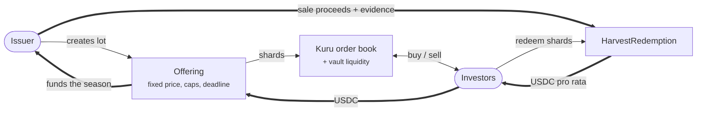
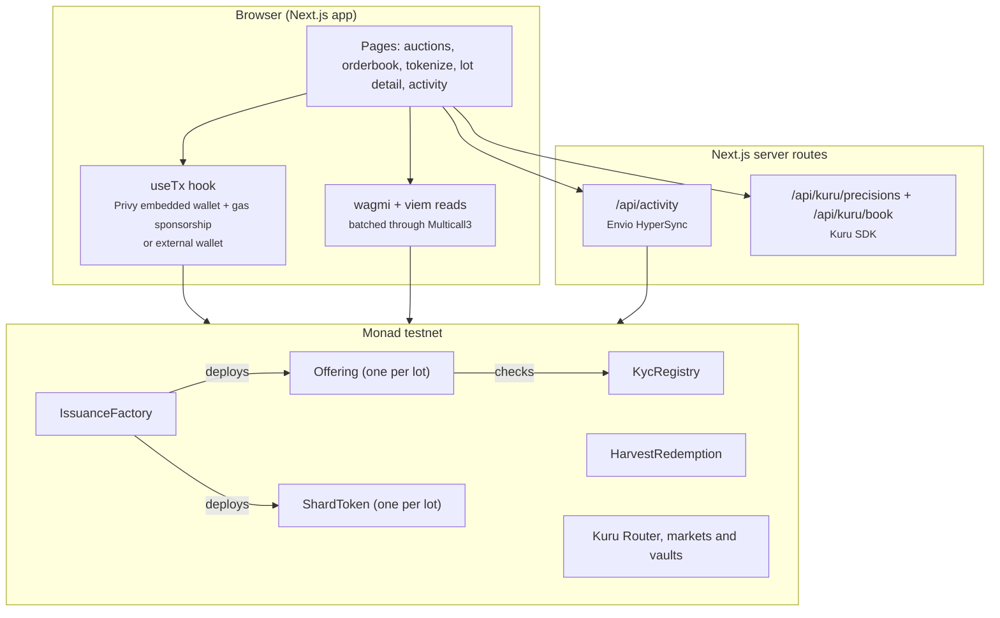

# FractaChain

**Argentine harvests, tradable onchain.** FractaChain lets a farmer or agri SME split a harvest lot into tokens called **shards**, raise funds in a primary offering, list the shards on **Kuru**'s fully onchain order book on **Monad**, and pay holders back in USDC when the crop is sold.

- **Live app:** https://fractachain-monad.up.railway.app (Monad testnet)
- **Demo video:** _coming soon_
- **Hackathon:** [Monad Metropolis](https://monad.xyz/developers/hackathons/metropolis), track **Onchain Finance & Trading**. Bounties: **Kuru** (Bring New Assets and Markets to Kuru) and **Privy**.

## The problem

Argentine farmers invested about US$ 13.8 billion in the 2024/25 season, and 70 % of it came from third parties, mostly through commercial credit from grain elevators, input suppliers and traders (Bolsa de Comercio de Rosario). Bank and capital-market financing is slow and expensive, and there is almost no secondary market: an investor who funds a harvest is locked in until it is sold.

## What FractaChain does

A full lifecycle for a new asset class, not just a trading screen:

| Step | What happens | Contract |
|---|---|---|
| 1. Issue | A KYC-verified issuer describes the lot (crop, tons, season) and sets supply, price, soft cap, hard cap and deadline. | `IssuanceFactory`, `ShardToken` |
| 2. Raise | Verified investors contribute USDC at a fixed price. Below the soft cap, everyone gets refunded automatically. | `KycRegistry`, `Offering` |
| 3. Open the market | The issuer creates the shard/USDC market on Kuru and seeds its vault with unsold shards and part of the proceeds, at the offering price. | Kuru `Router.deployProxy` |
| 4. Trade and provide liquidity | Anyone buys and sells against Kuru's order book, or deposits shards and USDC into the vault to earn fees. | Kuru market and vault |
| 5. Settle and redeem | When the crop is sold, the issuer deposits the USDC with a link and hash of the evidence. Each holder redeems shards pro rata. | `HarvestRedemption` |



## Architecture



- **No backend database.** All state is read from the chain. The two server routes only exist to keep an API token (HyperSync) and a heavy SDK (Kuru) out of the browser bundle.
- **Contracts** (`contracts/src`): `KycRegistry` (verified addresses), `IssuanceFactory` (creates a `ShardToken` and its `Offering` per lot and enforces that supply covers the hard cap), `Offering` (fixed-price raise with soft cap, hard cap, deadline, claim and refund, reentrancy-guarded), `ShardToken` (fixed-supply ERC-20 with asset metadata) and `HarvestRedemption` (one-time settlement per lot and pro-rata redemption).
- **Kuru** is used as-is: markets are deployed through Kuru's Router (V1 `deployProxy`) and traded through Kuru's market contracts. FractaChain does not run its own order book.
- **Onchain asset sheet:** every lot page shows the asset (crop, tons, season), total supply and the addresses of the issuer, token, offering, Kuru market and vault, all read from the chain and linked to the explorer. It shows no data that cannot be verified onchain.
- **Bilingual and mobile-ready:** the whole interface is available in Spanish and English and adapts to phone screens.
- **Mockups:** the Merval, Forwards and Warrants pages are product simulators and do not send transactions. The live flow is the lots flow described above.

## Why Monad

- **An onchain order book needs a fast, cheap chain.** Kuru runs a fully onchain CLOB on Monad, so every order, fill and cancellation is a transaction. Monad's throughput and low fees make that viable, and it is why FractaChain lists on Kuru instead of building an offchain matching engine.
- **Sponsored gas stays cheap.** The app pays gas for every user action (KYC, contribute, trade, redeem). Low fees keep sponsorship sustainable for small investors.
- **EVM compatibility.** Standard Solidity, Foundry, viem and wagmi, and Privy's EVM embedded wallets work out of the box.
- **Fast finality for a trading UX.** Quotes, fills and balance updates show up within seconds in the app.

## Tech stack

| Layer | Tools |
|---|---|
| Smart contracts | Solidity 0.8, Foundry (forge, anvil), forge-std |
| Chain | Monad testnet (chain ID 10143), Multicall3 |
| Exchange | Kuru Router, markets and vaults; `@kuru-labs/kuru-sdk` |
| Frontend | Next.js 15 (App Router), React 19, TypeScript, Tailwind CSS 4, lucide-react |
| Web3 | wagmi, viem, TanStack Query, ethers 5 (Kuru SDK and scripts) |
| Wallets | Privy (`@privy-io/react-auth`, `@privy-io/wagmi`): embedded wallets, gas sponsorship, export, account linking |
| Data | Envio HyperSync (activity history) |
| Deploy | Docker on Railway; contracts verified on Sourcify |

## Kuru integration

- **Market creation from the app.** The issuer clicks "Open market": the app deploys a shard/USDC market through Kuru's Router (`deployProxy`) and seeds the vault in the same flow. Market precisions come from `@kuru-labs/kuru-sdk`, computed server-side.
- **Orderbook page.** `/orderbook` shows every listed pair with Kuru's L2 book (12 levels per side, including vault liquidity, refreshed every 10 s). Clicking a level loads that size into the order panel.
- **Trading.** Market buy and sell orders (`placeAndExecuteMarketBuy/Sell`) with a quote before signing, slippage tolerance (0.5 / 1 / 3 %) enforced as `minAmountOut`, and token approval only when needed.
- **Liquidity provision.** Anyone can deposit shards and USDC into the market's vault at the current price and withdraw their share later. In a testnet fork, adding 2,000 shards and 241.6 USDC cut the price impact of a 10 USDC buy from ~11 % to ~3 %.
- **Initial market formation.** The vault is seeded at the primary-offering price, so trading opens anchored to what investors paid. The plan adds a per-lot liquidity reserve and a designated market maker (see the [legal and operations plan](LEGAL_AND_OPERATIONS_PLAN.md#8-liquidity-and-initial-market-formation)).
- **Activity history.** `/actividad` rebuilds every trade, contribution, claim, liquidity move and redemption from chain data through Envio HyperSync, because Kuru's `Trade` event has no indexed fields.

## Privy integration (beyond login)

| Feature | How it is used |
|---|---|
| Embedded wallets | Created automatically on email or Google login. A farmer never installs a wallet or writes down a seed phrase. |
| Gas sponsorship | Every transaction (KYC, test funds, contribute, claim, trade, liquidity, settle, redeem) is sent with `sponsor: true`. New users operate with **0 MON**. If sponsorship fails, the app falls back to a normal transaction. |
| Wallet export | "Export wallet" in the account menu gives the user their private key: real self-custody. |
| Account linking | Users can link email and Google to the same account. |
| External wallets | Users who already have a wallet can connect it; the app signs with it the same way. |

All writes go through a single hook, `frontend/src/hooks/useTx.ts`, which picks the Privy embedded wallet with sponsorship or the connected external wallet.

## Legal and operational plan

A shard offered to the public in exchange for a share of a harvest's sale proceeds is a security (*valor negociable*) under Argentina's Capital Markets Law 26,831. Instead of avoiding the regulator, FractaChain plans to use the regime Argentina's securities regulator (CNV) built for this:

- **Structure:** a financial trust (*fideicomiso financiero*) with public offering, whose participation certificates are represented as tokens under CNV General Resolutions 1069/2025, 1081/2025, 1087/2025 and 1150/2026. The sandbox runs until 31 December 2027. A tokenized farmland trust was already approved under this regime in 2025.
- **Collateral:** grain deposited with a registered warehouse, backed by electronic deposit certificates and warrants (Law 9643, Decree 640/2024).
- **Compliance:** VASP (PSAV) registration with the CNV (Law 27,739, RG 1058/2025), KYC/AML, and a permissioned wrapper to extend KYC to the secondary market.

Full plan with sources, risks, operating cycle and open legal questions: [`LEGAL_AND_OPERATIONS_PLAN.md`](LEGAL_AND_OPERATIONS_PLAN.md).

## Business model

**Customers.** Farmers and agri SMEs raise money before harvest; investors get dollar exposure to a real harvest from small amounts, with an exit on Kuru at any time; grain elevators and cooperatives finance their farmers with third-party money instead of their own balance sheet.

**What we compete against.** Farmers already pay their elevator a marketing commission of about 2% of the grain's value for soy and wheat (INTA, 2025/26 season) and finance the season at 8.5% to 12.5% a year in dollars (Bolsa de Comercio de Rosario, 2025/26). FractaChain does not add a new layer of cost: it shares what the circuit already charges, and only earns when a lot works.

| Revenue | Who pays | When |
|---|---|---|
| Share of the marketing commission | Partner elevator, from the commission it already charges | When the lot's harvest is sold and settled. |
| Reduced success fee (0.5% of the amount raised) | Issuer | Only when an auction reaches its minimum. |
| Lot structuring | Issuer or elevator | When the series is set up (due diligence, documents, trust). |
| White-label licence | Elevators, cooperatives, fintechs | Monthly or per originated lot. |

**One lot, illustrated.** 1,000 t of soy (US$ 316,000 of grain) financed with a US$ 250,000 auction: half of the elevator's ~1.9% commission (US$ 2,950) plus the 0.5% success fee (US$ 1,250) gives **US$ 4,200 per lot**. For the farmer only the 0.5% is new, about one point annualized over a six-month season, so the total cost stays within the 8.5% to 12.5% benchmark if investors accept 6% to 8% a year.

**Liquidity is a strategy, not a revenue line.** The issuer seeds the Kuru vault with unsold shards and part of the proceeds, any holder can add liquidity, and an external market maker is planned. FractaChain does not need its own capital to open markets.

The deployed contracts charge no fees yet; the success fee is planned for the next version of `Offering`. Full model with costs, channels, metrics and sources: [`BUSINESS_MODEL.md`](BUSINESS_MODEL.md).

## Deployed on Monad testnet (chain ID 10143)

| Contract | Address |
|---|---|
| `KycRegistry` | `0xe42FF6D4d9ED6603873144D3B1C46B6317d45FC9` |
| `IssuanceFactory` | `0xdbb769E14687DFD90f319A225b5fF8eA423Bb68F` |
| `HarvestRedemption` | `0xeccA331e9b090463aBf9F2077AbFf2110d668d2c` |
| Mock USDC (`mUSDC`, 6 decimals, open mint) | `0xBf11e27C5C26E11E4B213fBCc5d5EDBb29453d36` |
| Kuru Router | `0x7EFbE105Ca7415dE98F96622173458ac1c054630` |

| Lot | Shard token | Kuru market |
|---|---|---|
| SOJA26 | `0x3AbA80ACDc4F35666012e3bdF1c1bca56996630D` | `0x24B6dB71754086e87eF0d0C0F83C067b58Fb9B7f` |
| MAIZ27 | `0x40a7e67e5b147264460980fb226e320e2434a074` | `0x02633Ff7Dc67F934131804F289FfEb941ac2aaF6` |

The payment token is a mock USDC we deployed. Kuru's web app only exposes mainnet, so we could not obtain Kuru's official testnet USDC (`0x3bA3d39AFcf8bb994f7964B3e0171Ea2Ba361570`). The contracts work with any ERC-20 payment token.

## What has been tested

- **Contracts:** 95+ Foundry tests (unit, fuzz and invariant) across the KYC registry, token, offering, factory and harvest redemption, plus end-to-end flows and a security suite with malicious tokens. The offering invariants held over 128k calls.
- **Kuru, on a fork:** any account can deploy a market for a custom token; trade units validated (a 1 USDC buy returned 9.92 MAIZ27, matching the quote; an impossible `minAmountOut` reverted with `SlippageExceeded`).
- **Monad testnet, for real:** offering filled to the hard cap, finalized and claimed; Kuru markets created and seeded from the app; buys and sells from a Privy embedded wallet with 0 MON.
- **Verification:** the deployed contracts are source-verified on Sourcify (`exact_match`).

Not done yet: an external security audit and a run with Kuru's official testnet USDC.

## Repository layout

| Path | What it is |
|---|---|
| `contracts/` | Solidity + Foundry: contracts, deploy scripts and tests. Guide: [`contracts/CONTRACTS.md`](contracts/CONTRACTS.md). |
| `frontend/` | Next.js + wagmi + viem + Privy. Setup and env vars: [`frontend/README.md`](frontend/README.md). |
| `scripts/kuru/` | CLI script that opens a Kuru market and seeds its vault. |
| [`LEGAL_AND_OPERATIONS_PLAN.md`](LEGAL_AND_OPERATIONS_PLAN.md) | Legal and operations plan. |
| [`BUSINESS_MODEL.md`](BUSINESS_MODEL.md) | Business model. |
| [`PROJECT_LOG.md`](PROJECT_LOG.md) | Project log: decisions, status and open questions. |

## Quick start

Requirements: [Foundry](https://book.getfoundry.sh/getting-started/installation) and Node.js.

```bash
git clone --recurse-submodules https://github.com/Antony27c/FractaChain-Monad.git
cd FractaChain-Monad/contracts
forge test
```

Frontend against Monad testnet (needs a Privy App ID in `frontend/.env.local`, see `frontend/.env.example`):

```bash
cd frontend
npm install
npm run dev
```

For a fully local run on anvil without Privy, see [`frontend/README.md`](frontend/README.md).

## Roadmap

| Phase | Goal |
|---|---|
| 1. Closed pilot | One real lot with a partner grain elevator and qualified investors; real settlement through `HarvestRedemption`; external audit. |
| 2. Regulated structure | Financial-trust program with one series per lot and tokenized certificates; VASP registration (own or partner); permissioned secondary market; Monad mainnet. |
| 3. Scale | Several series per season, a designated market maker, peso on/off-ramps, automated season reports. |
| 4. New assets | Livestock and regional economies, electronic warrants as collateral, loans against shards. |

## Third-party code and attribution

FractaChain's contracts, scripts and frontend were written by the team during the hackathon. It builds on these open-source projects and services, used under their own licenses:

| Project | Use |
|---|---|
| [forge-std](https://github.com/foundry-rs/forge-std) (MIT/Apache-2.0) | Test and script utilities for Foundry (git submodule in `contracts/lib`). |
| [Kuru](https://kuru.io) contracts and [`@kuru-labs/kuru-sdk`](https://www.npmjs.com/package/@kuru-labs/kuru-sdk) | Order book, vaults and market parameters. Kuru's ABIs are included in `frontend/src/lib/kuru.ts`. |
| [Privy](https://privy.io) (`@privy-io/react-auth`, `@privy-io/wagmi`) | Login, embedded wallets, gas sponsorship. |
| [Next.js](https://nextjs.org), [React](https://react.dev), [Tailwind CSS](https://tailwindcss.com), [lucide-react](https://lucide.dev) | Web framework, UI and icons. |
| [wagmi](https://wagmi.sh), [viem](https://viem.sh), [TanStack Query](https://tanstack.com/query), [ethers](https://docs.ethers.org/v5/) | Chain reads and writes. |
| [Envio HyperSync](https://envio.dev) | Indexed chain history for the activity page. |

Third-party names and logos shown in the app (for example BYMA, Caja de Valores or Matba Rofex) are references to Argentine market infrastructure. FractaChain has no agreement or partnership with them.

## AI tools disclosure

We used AI coding assistants during the hackathon (Claude Code, Cursor and Devin) to help write and review code, tests and documentation. All AI-assisted changes were reviewed, tested and committed by the team.

## License

[MIT](LICENSE).

## Origin

FractaChain was first prototyped by our team on another ecosystem, where it won 1st place in the Genesis track of the Argentina Builder Challenge (BAF x Stellar). For Monad Metropolis we rebuilt it from scratch: all contracts, scripts and frontend in this repo were written during the hackathon. No Soroban code was reused, only the idea and the design. Original repo: [Erosmart/fractachain](https://github.com/Erosmart/fractachain).
